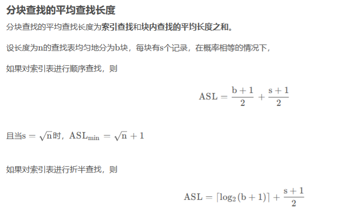
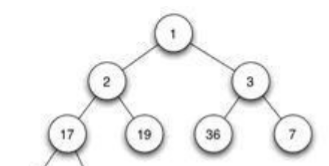

# 查找与排序
## 前言

* 本文主要包括查找算法和经典排序算法两个部分
* 使用语言：c/c++
* 仅用于个人学习记录，如有细节错误望理解（欢迎指正）
* 持续更新中,完整可运行代码见文末
* 参考
   1. https://www.runoob.com/w3cnote/merge-sort.html (归并排序开始)
## 查找
**首先要理解什么是查找。**
查找是在相同数据类型的集合中，使用唯一标识（关键字K）来查找数据元素（V）。

**平均查找长度** ASL = $P_1C_1 + P_1C_2 + ......$
其中$P_i$是概率，$C_i$是查找第i个元素比较过的次数。
用于分析算法性能。

**查找有哪些方法：**
* 比较式查找法 (1).线性表的查找 (2).树的查找
* 计算式查找法 (1).hash查找


理解以上三点后开始进一步学习具体的查找方法。

### 比较式查找-基于线性表的查找

#### 顺序查找
存储方式可以是顺序结构，也可以是链式结构
按顺序与关键字比对查找。
```c
typedef struct
{
    int key;
    int val;
}KeyValueType;
```
具体查找代码省略。只需在顺序表中逐个查找对比。

**平均查找长度：**
设列表中每个数概率相同 P = 1/n。
ASL = $1/n * (1 + 2 + 3 + ... + n)$ = $(1+n)*n/2 * (1/n)$ = $(1+2)/n$
#### 折半查找
**使用折半查找的先前条件：必须是有序排列的顺序表**
代码：
```c
// 方便起见不用结构体，直接在int数组里查找，key就是要查找的值x
int BinSearch(int x)
{
    int low = 0,high = n,mid = (high - low)/2 + low;
    while (low < high)
    {
        if (arr[mid] = x)
        {
            return mid;
        }
        else if (arr[mid] < x)
        {
            low = mid + 1;
        }
        else
        {
            high = mid - 1;
        }
        mid = (high - low)/2 + low;
    }
    return -1;
}
```
**平均查找长度：**
设每个数的概率一致为P = $1/n$。

* 简单计算方法，可以将长度为n的数组看成n个结点的满二叉树（不妨设刚好满足），这样一来，我们发现，每一次选择一半，就相当于从二叉树底层开始向上攀爬。假设最多选择比较了h次，刚好就是二叉树的高度。
**根据满二叉树的性质 $h = log_2(n+1)$**
换而言之只需要查找h次就一定能找到答案。

* 公式计算：
ASL = $1/n * Σ_{i=1->n}i*2^{i-1} = (n+1)/n * log_2(n+1) - 1$
当n足够大时，趋近于$log_2(n+1)$

折半查找效率很高，但是要求必须为有序表,导致插入删除很麻烦。
#### 分块查找
通俗来讲，将数组分为多个块，块内数据无序，但是块与块之间有序（如 块0所有元素小于块1的任意元素）。
这是一种结合了折半查找和顺序查找的方法。性能介于两者之间。

**模拟一下过程：**
* 建立索引表，用于指出块的起始位置和最大值。
* 使用折半查找，找到x所在的块，比较方法是比对每个块的最大值maxv。假设块是递增的，那么找到第一个大于等于x的maxv就行。
* 使用顺序查找，在块内逐个比对。

```c
// 注意这里的key有两个
typedef struct
{
    int maxKey;     // 索引区间的最大键值
    int address;    // 索引区间的起始地址（下标）
}Index;
```
具体查找代码
```c
int BlockSearch(Index *index, int indexLen, int x)
{
    // 先折半查找索引表，找到关键值的索引区间
    int low = 0,high = n,mid = (high - low)/2 + low;
    while (low < high)
    {
        // index.maxKey存储了最大的值 
        if (x == index[mid].maxKey)
        {
            break;
        }
        else if (x < index[mid].maxKey)
        {
            // TODO:这里尤其注意，我们是用最大值进行比较
            // 但是同时，如果我们发现该最大值大于x，我们没有把握说这个x是在找到的这个块，还是前一个。
            // 所以如果high = mid - 1,有可能会错过正确答案。 
            high = mid;
        }
        else
        {
            low = mid + 1;
        }
        mid = (high - low)/2 + low;
    }
    
    // 跳出循环，mid就是要找的索引,就能确定块的start和end 
    int start = index[mid].address, end;
    if (mid == indexLen - 1)
    {
        end = n;
    }
    else
    {
        end = index[mid + 1].address;
    }
    
    // 最后顺序查找返回索引下标 
    for (int i = start; i < end; i++)
    {
        if (x == arr[i])
        {
            return i;
        }
    }
    return -1;
}
```
**平均查找长度：**
TODO:待计算


### 基于树的查找
#### 二叉排序树(BST)
二叉排序树就是二叉搜索树或者二叉查找树
根结点上的左子树结点均小于根结点，右子树结点则大于根结点
中序遍历后得到递增有序序列

简单二叉排序树的存储结构
```c
// 用于二叉搜索树 
struct TreeNode {
    int key; // 存储key 
    TreeNode *left;
    TreeNode *right;
    TreeNode() : key(-1), left(nullptr), right(nullptr) {}
    TreeNode(int x) : key(x), left(nullptr), right(nullptr) {}
    TreeNode(int x, TreeNode *left, TreeNode *right) : key(x), left(left), right(right) {}
};
static TreeNode *root;
```
##### 创建和插入二叉树排序树
```c
// 创建二叉搜索树（排序树）,使用int作key 
// key是唯一标识不重复 
void CreateBST()
{
    int key;
    TreeNode *bst = nullptr;
    scanf("%d",&key);
    while (key != -1)
    {
        Insert(bst,key);
        scanf("%d",&key);
    } 
}
//递归插入，用于向二叉树中插入某一结点
void Insert(TreeNode *bst,int key)
{
    if (bst == nullptr)
    {
        TreeNode *node = new TreeNode(key);
        bst = node;
    }
    else if (bst->key > key)
        Insert(bst->left,key);
    else 
        Insert(bst->right,key);
}
```
#####排序树的查找
```c
TreeNode* Search(TreeNode *bst,int key)
{
    if (!bst) return nullptr;
    
    if (key == bst->key)
        return bst;
    else if (key < bst->key)
        return Search(bst->left,key);
    else 
        return Search(bst->right,key);		
} 
```
##### 删除
##### 性能
平均查找长度与分支均衡程度有关。
树深度越小，ASL越小。
#### 平衡二叉树（排序树）
又叫做AV树，属于二叉排序树。
* 左子树和右子树高度相差小于等于1
* 平衡因子 = 左 - 右 = {0，1，-1}
//TODO:代码
#### B树（排序树）//TODO:b树补充
B树属于m插排序树
**要求**
* 每个结点最多m棵子树
* 根结点至少两棵子树
* 除根结点外非叶子结点至少有一棵子树
* 叶子节点在同一层，称为失败结点，不存储信息，用于分析性能。
存储结构如下
```c
#define RANK 10 
// 用于m叉搜索树 也就是B树 
struct BTreeNode 
{
    int keyNum;  // 存储key的数量 
    int key[RANK]; // 因为叶子结点不放信息了，所以只能让父结点存储子结点的信息 
    BTreeNode *p; // 父结点 
    BTreeNode *ptr[RANK]; //子树数组 
    BTreeNode() : keyNum(RANK),p(nullptr)
    {
        for (int i = 0; i < RANK; i ++)
        {
            key[i] = i;
            ptr[i] = nullptr;
        }
    }
};
```

### 计算式查找-哈希查找
#### 哈希函数的构造
##### 构造原则
* 函数便于计算
* 设关键字为k,f(k)的地址概率一致，减少冲突。
##### 具体构造方法
* 数字分析法：事先知道关键字集合，并且关键词比地址码位数多，可以使用,选取均匀的若干位。
//TODO:待补充

构造哈希函数要考虑的东西：
* 计算函数的时间
* 关键字长度
* 哈希表大小
* 关键字分布
* 查找频率
#### 处理冲突的方法
* 开放定址法：关键字冲突则以冲突的地址为基础产生新的地址，如此递归，直到不冲突。
  * 线性探测再散列：顺序表查看下一个单元
  * 二次探测再散列：左右探测
  * 伪随机探测再散列：建立伪随机发生器重新给到新地址
* 再哈希算法：不断构造不同哈希函数，直到不冲突
* 链地址法：构造同义词单链表，相同key放到同一个单链表。
  整个哈希表存储单链表头指针。
#### 性能分析
除了哈希函数本身，处理冲突的方法以外，填装因子也影响着性能，
$α = n / length$ n表示哈希表元素个数，length则是哈希表长度。

## 排序算法


### 插排

1. 数组存储，边插入，边排序，双重循环

2. 内循环用将要插入的数从后往前比较，随着已插入的数增加，比较的次数也会增加

时间复杂度为O(n^2)

#### 折半插入排序

1. 将待插入数组看成有序表（初始为0个元素）
2. 每插入一个元素，都对有序表循环二分，直到找到合适位置插入
3. 虽然二分的复杂度只有$O(log_2n)$,但是移动后续的元素仍然有O(n)，最终复杂度仍然为O（n^2)

```c
	// 二分插入排序
	void BinInsertSort(int n)
	{
		int insert;
		for (int i = 0; i < n; i ++)
		{
			int low = 0, high = i,mid = (high - low)/2 + low;
			// 假设边输入边插入，也可以用事先存储的数据 
			cin >> insert;
			
			// 第一个数直接放在第一位 
			if (i == 0) {
				arr[0] = insert;
				continue;
			}
			
			while (low <= high)
			{
				if (arr[mid] > insert)
					high = mid - 1;
				else
					low = mid + 1;
				mid = (high - low)/2 + low;
			}
			// 因为要想插入还需要移动后面的数据
			// 数组中已有i个数,正在插入第i+1个数 
			for (int j = i; j >= low; j --)
				arr[j + 1] = arr[j]; 
			arr[low] = insert;
		}
		// 输出排序结果
		for (int i = 0; i < n; i ++)
		{
			cout<<arr[i]<<' ';
		}
	} 
```

#### 表插入排序

使用链表存储进行插入排序

原理与普通插排一样，时间复杂度为O(n^2)

### 选择排序

#### 简单选择排序

选择出第i小（大）的数。注意区别冒泡排序

复杂度O（n^2)s

```c
// 冒泡,冒泡虽然也是将第i小（大）的数找出来，但是经历了一定次数交换
// n + n-1 + n-2 + ... 
void BubbleSort()
{
    int t[ARRSIZE];
    for (int i = 0; i < ARRSIZE - 1; i ++)
    {
        for (int j = 1; j < ARRSIZE; j ++)
        {
            if (arr[i] > arr[j]) 
            {
                swap(arr[i],arr[j]);
            }
        }
    }
}

// 反观选择排序，则是将第i小（大）的数的下标保存下来，虽然比较次数不变，但是省略了数据交换(swap)的环节
// 简单选择
	void SimpleSelect(int n)
	{
		int k;
		for (int i = 0; i < n - 1; i ++)
		{
			k = i;
			for (int j = i + 1; j < n; j ++)
			{
				if (arr[i] > arr[j])
					k = j;
			}
			if (k != i) 
				swap(arr[i],arr[k]);
		} 
	} 
```

#### 树选择排序

树形结构，因为二叉树的特殊结构，比较次数每次除以2，时间复杂度为O（nlog_2n）。

### 堆排序

堆排序是基于树选择排序的改进

将数据放在完全二叉树中，根结点>=子结点为大根堆，反之为小根堆。

下图为小根堆



实际使用中将数据放在数组中便于存储
下标从0开始
父结点：$（i-1）/2$,左子：$2*i+1$，右子：$2 * i+2$

**基本过程**

1. 首先将待排序的数组构造成一个大根堆，此时，整个数组的最大值就是堆结构的顶端

2. 将顶端的数与末尾的数交换，此时，末尾的数为最大值，剩余待排序数组个数为n-1

3. 将剩余的n-1个数再构造成大根堆，再将顶端数与当前大根堆末尾位置的数交换，如此反复执行。

```c
// 堆排序

// 辅助函数
// 让当前堆顶的数下沉，值最小的话就沉入最底 
void createMaxHeap(int start, int end) {
    //建立父节点指标和子节点指标
    int dad = start;
    int son = dad * 2 + 1;
    while (son <= end) { //若子节点指标在范围内才做比较
        if (son + 1 <= end && arr[son] < arr[son + 1]) //先比较两个子节点大小，选择最大的
            son++;

        if (arr[dad] > arr[son]) //如果父节点大于子节点代表调整完毕，直接跳出函数
            return;
        else { //否则交换父子内容再继续子节点和孙节点比较
            swap(arr[dad], arr[son]);
            dad = son;
            son = dad * 2 + 1;
        }
    }
}
void heapSort(int len) {
    // 从小到大排序，创建大根堆，从最后一个非叶子父结点开始往前
    for (int i = (len-1) / 2; i >= 0; i--)
        createMaxHeap(i, len - 1);
    //先将第一个元素和已经排好的元素前一位做交换，再从新调整(刚调整的元素之前的元素)，直到排序完毕
    for (int i = len - 1; i > 0; i--) {
        swap(arr[0], arr[i]);
        createMaxHeap(0, i - 1);
    }
} 
```

时间复杂度为$O(nlog_2n)$

### 归并排序
分解-解决-合并

```c
// 归并排序
// 非递归 
template<typename T> // 整數或浮點數皆可使用,若要使用物件(class)時必須設定"小於"(<)的運算子功能
void merge_sort(T arr[], int len) 
{
    T *a = arr;
    T *b = new T[len]; // 存储归并排序后的结果 
    for (int seg = 1; seg < len; seg += seg) 
    {
        for (int start = 0; start < len; start += seg + seg) 
        {
            int low = start, mid = min(start + seg, len), high = min(start + seg + seg, len);
            int k = low;
            int start1 = low, end1 = mid;
            int start2 = mid, end2 = high;
            while (start1 < end1 && start2 < end2) // 比较 
                b[k++] = a[start1] < a[start2] ? a[start1++] : a[start2++];
            while (start1 < end1)
                b[k++] = a[start1++];
            while (start2 < end2)
                b[k++] = a[start2++];
        }
        T *temp = a;
        a = b;
        b = temp;
    }
    if (a != arr) {
        for (int i = 0; i < len; i++)
            b[i] = a[i];
        b = a;
    }
    delete[] b;
} 	
	
// -------递归---------
void merge_sort_recursive(int arr[], int reg[], int start, int end) 
{
    if (start >= end)
    return;
    int len = end - start, mid = (len >> 1) + start;
    int start1 = start, end1 = mid;
    int start2 = mid + 1, end2 = end;
    merge_sort_recursive(arr, reg, start1, end1);
    merge_sort_recursive(arr, reg, start2, end2);
    int k = start;
    while (start1 <= end1 && start2 <= end2)
    reg[k++] = arr[start1] < arr[start2] ? arr[start1++] : arr[start2++];
    while (start1 <= end1)
    reg[k++] = arr[start1++];
    while (start2 <= end2)
    reg[k++] = arr[start2++];
    for (k = start; k <= end; k++)
    arr[k] = reg[k];
}

void merge_sort(int arr[], const int len) {
    int reg[len];
    merge_sort_recursive(arr, reg, 0, len - 1);
}
```
归并排序时间复杂度O(nlog_2n)

### 快速排序
* 从数列中挑出一个元素，称为 "基准"（pivot）;
* 重新排序数列，所有元素比基准值小的摆放在基准前面，所有元素比基准值大的摆在基准的后面（相同的数可以到任一边）。在这个分区退出之后，该基准就处于数列的中间位置。这个称为分区（partition）操作；
* 递归地（recursive）把小于基准值元素的子数列和大于基准值元素的子数列排序；
```c
// 快排，递归
int Paritition(int A[], int low, int high) {
    int pivot = A[low];
    while (low < high) {
        while (low < high && A[high] >= pivot) {
        --high;
        }
        A[low] = A[high];
        while (low < high && A[low] <= pivot) {
        ++low;
        }
        A[high] = A[low];
    }
    A[low] = pivot;
    return low;
}

void QuickSort(int A[], int low, int high)
{
    if (low < high) {
        int pivot = Paritition(A, low, high);
        QuickSort(A, low, pivot - 1);
        QuickSort(A, pivot + 1, high);
    }
} 
```

### 分类排序
#### 基数排序
基数排序是一种非比较型整数排序算法，其原理是将整数按位数切割成不同的数字，然后按每个位数分别比较。由于整数也可以表达字符串（比如名字或日期）和特定格式的浮点数，所以基数排序也不是只能使用于整数。

**可以采用链式和顺序表两种结构存储。**
一般使用链式，整体思路是：
* 先按照个位进行分类，建立0到9号链表，个位数数值一致则归类到一个链表
* 然后是十位数，百位数进行分类，以此类推，直到排序完成。
时间复杂度为O(d(n+rd))
显然基数排列适合位数小的序列。
其中d是数的位数，
代码略


github仓库地址：