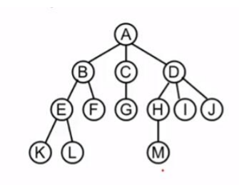
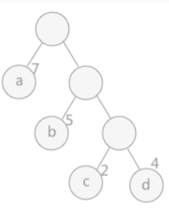

# Re0:数据结构与算法之 树与二叉树

TODO:2023/08/18 19:00: 1.递归非递归遍历 2.线索树
TODO:2023/08/21 20:00: 1.取消stl的使用 2.树，森林，二叉树 3. 哈夫曼编码 4. 并查集的应用

## 前言

* 使用语言：c/c++
* 仅个人学习记录，如有细节错误望理解（欢迎指正）
* 完整可运行代码见文末
* 持续更新中

## 什么是树

* 定义：n（n>=0）个结点的有限集合。n = 0为空树。

  什么是结点？可以理解成一个包含数据区域和若干个指向其他结点的指针的结构体。

  对于非空树，有且仅有一个根结点，其他结点皆有前驱结点。

* 表示方法：

  * 倒置树结构（如下图)

    

  * 文氏图

  * 广义表

  * 凹入表示法

* 基本术语

  * 度：分为结点的度和树的度两种。前者是该节点的子树数量，也即后驱结点个数；后者则是所有结点度的最大值。
  * 叶结点：也称为终端结点
  * 层级：从根结点往下，1-n
  * 树的高度：最大层级数
  * 结点的名称：子结点，根结点，父结点（双亲结点），兄弟结点，堂兄弟结点等等。
  * m（m>=0）棵互不相交的树。

## 二叉树

二叉树中一个结点的后驱结点最大只能为2。

除了叶子结点外，如果所有结点都有2个后驱结点，就叫做**满二叉树**。
另外还有一种二叉树叫做完全二叉树，除了最后一层相较于满二叉树可能有缺失外，其他一致。满二叉树一定是完全二叉树。
**注意**，完全二叉树按照从左到右，从上到下的顺序，在遍历完所有结点之前不会遇到空结点。

### 二叉树的性质

* **性质1：第 i 层的最多有 $2^{i-1}$结点**
  证明：由于下一层 = 上一层 * 2
  第一层有1个结点，第二层2个，第三层4个... 
  所以第i层$2^{i - 1}$个
  
* **性质2：深度为k的二叉树，最多有$2^{k}$ - 1个结点**
  证明：利用上一个性质的结论，第i层最多有$2^{k - 1}$个结点
  深度为k，那么结点数最多共计
  S = $2^{0}$ + $2^{1}$ + $2^{2}$ + ... + $2^{k - 1}$
  2S = $2^{1}$ + $2^{2}$ + $2^{1}$ + ... + $2^{k - 1}$
  S = 2S - S = $2^{k}$ - $2^{0}$ = $2^{k}$ - 1
* **性质3：对于任意二叉树T，叶子结点数为$n_0$,度数为2的结点数位$n_2$,那么$n_0$ = $n_2$ + 1。***
  证明： 先来分析一下，二叉树只有度为0-叶子结点，度为1，2的其他结点。
  设度为1的结点有$n_1$个，总结点数为n。
  n = $n_0$ + $n_1$ + $n_2$ ①

  然后，除了叶子，所有结点都有至少一个结点，我们可以根据子结点来计算n
  n = $n_0$ * 0 + $n_1$ * 1 + $n_2$ * 2 + 1（不要忘记根结点）②
  ② - ① = $n_2$ + 1 - $n_0$ = 0
  即证 $n_0$ = $n_2$ + 1，度为0的结点比度为2的结点多一个。
* **性质4：具有n个结点的完全二叉树深度为$[log_2n ] (向下) + 1$**
  性质1，2是根据深度推导结点个数，3是0度和2度结点数关系。
  性质4则是根据结点数推导二叉树深度。
  证明：首先，完全二叉树保证了除了最后一层，其他层都与满二叉树完全相同。总结点数小于等于满二叉树的结点数。
  根据性质2深度为k的二叉树最多有$2^{k}$ - 1个结点
  我们设深度为k，那么可以得到以下不等式
  $$
  2^{k - 1} - 1 < n <= 2^{k} - 1
  $$
  简化后
  $$
  2^{k - 1} <= n < 2^{k}
  $$
  即得$k<=log_2n + 1$
* **性质5：在完全二叉树中，按照从左到右，从上到下，从1开始对结点进行编号，有以下性质：**
  1. 若i = 1,为根结点。i > 1则双亲结点序号为i/2
  2. i > n/2(叶子),则没有左孩子结点；i < = n/2,则左孩子结点序号为2 * i。
   证明：深度为k的满二叉树，最后一层最大有$2^{k-1}$个结点。除去最后一层一共有$2^{k - 1} - 1$,前k-1层总数少于最后一层，也就是小于n/2个结点。
      另一个方面来说，i<=n/2时，i层某个结点到它的左子结点，刚好经过了i个结点。
  3. i * 2 + 1 > n,则无右孩子；否则有孩子结点序号为2 * i + 1。


### 二叉树的遍历(Traverse)
二叉树的存储结构分为顺序和链式两种，顺序结构采用结构体数组将数据存储在连续存储单元。

以下采用链式结构。
二叉树数据结构
```c++
struct TreeNode {
    int val;
    TreeNode *left;
    TreeNode *right;
    TreeNode() : val(0), left(nullptr), right(nullptr) {}
    TreeNode(int x) : val(x), left(nullptr), right(nullptr) {}
    TreeNode(int x, TreeNode *left, TreeNode *right) : val(x), left(left), right(right) {}
};
static TreeNode *root;
```
**以下使用递归遍历(非递归在后面)**
#### 前序(先序)遍历
先左子树后右子树，无限递归。
```c++
void PreOrderTraverse(TreeNode *root)
{
  if (!root)
    return;
  // TODO:对当前结点操作 
  PrintTBTreeNode(root);
  PreOrderTraverse(root->left);
  PreOrderTraverse(root->right);
}
```
#### 中序遍历
先左后根最后右
```c++
void InOrderTravere(TreeNode *root)
{
  if (!root)
    return;
  InOrderTravere(root->left);
  // TODO:对当前结点操作 
  PrintTBTreeNode(root);
  InOrderTravere(root->right);
}
```
#### 后序遍历
先左后右最后根
```c++
void PostOrderTraverse(TreeNode *root)
{
  if (!root)
    return;
  PreOrderTraverse(root->left);
  PreOrderTraverse(root->right);
  // TODO:对当前结点操作 
  PrintTBTreeNode(root);
}
```
#### 层序遍历
```c++
void LevelOrderTraverse(TreeNode *root)
{ 
  if (!root) return;
  qu.push(root);
  level = 0;
  while(!qu.empty())
  {
    int n = qu.size();
    LevelArr.push_back(vector<int>());
    for (int i = 0; i < n; i ++)
    {
      TreeNode *tmp = qu.front();
      qu.pop();
      // TODO:层序遍历操作
      PrintTBTreeNode(tmp);
      LevelArr[level].push_back(tmp->val); //二维数组记录 
      if (tmp->left)
        qu.push(tmp->left);
      if (tmp->right)
        qu.push(tmp->right);
    }
    level ++; 
  }
} 
```
#### 非递归算法实现遍历
为什么使用非递归算法？、
递归需要系统提供隐式栈实现，效率低且无法适应无递归语言设施。
##### 前序
```c++
void PreOrderTraverse1(TreeNode *root)
{
  stack<TreeNode*> st;
  TreeNode* node = root;
  while (node || !st.empty()) // node指向当前新指针，stack存储待开发的旧指针 
  {
    if (node)
    {
      // 先序遍历：先输出当前结点(左),保证push进去的结点不为空
      PrintTBTreeNode(node);
      st.push(node);
      node = node->left;
    }
    else
    {
      node = st.top()->right;
      st.pop();
    }
  }		
}
```
##### 中序
```c++
void InOrderTraverse1(TreeNode *root)
{
  if (!root) return;
  stack<TreeNode*> st;
  TreeNode* node = root;
  while (node || !st.empty())
  {
    if (node)
    {
      st.push(node);
      node = node->left;
    }
    else
    {
      // 中序遍历输出 最左的非空结点(输出左结点)
      node = st.top();
      st.pop();
      // TODO: 输出位置 
      PrintTBTreeNode(node); 
      
      // 转移指针到右结点,因为右子树也需要递归判断 
      node = node->right; 
    }
  }		
}
```
##### 后序
```c++
void PostOrderTraverse1(TreeNode *root)
{
  if (!root) return;
  stack<TreeNode*> st;
  TreeNode* node = root,*recent = nullptr;
  while (node || !st.empty())
  {
    if (node)
    {
      st.push(node);
      node = node->left;
    }
    else
    {
      // 后序遍历需要先输出右结点才能输出相对根结点				
      node = st.top();				
      // 直到右子结点是空结点才输出 
      if (node->right && node->right != recent)
      {
        st.push(node->right);
        node = node->right->left;
      }
      else
      {
        // TODO: 输出位置 
        PrintTBTreeNode(node);
        recent = st.top(); // 记录最近一次访问
        st.pop();
        node = nullptr;
      }
    }
  }		
}
```

### 线索二叉树
**前言**：我们在使用二叉树时，无法直接获得某个结点的前驱或后继的信息，只能从根结点开始遍历；另一方面，一个二叉树中，n个结点有2n个指针域，但是真正存储了信息的只有n-1个。

现在需要利用多余的指针域指向前驱和后继，这种指针称为线索。
而这种二叉结构又叫做线索链表。
**遍历并插入线索的操作叫做线索化**

数据结构如下
```c++
// 线索树结点 
struct ThreadTreeNode {
    int val;
    int lTag;
    int rTag;
    TreeNode *left;
    TreeNode *right;
    ThreadTreeNode() : val(0), lTag(0), rTag(0), left(nullptr), right(nullptr) {}
    ThreadTreeNode(int x) : val(x), lTag(0), rTag(0),left(nullptr), right(nullptr) {}
    ThreadTreeNode(int x,int lTag,int rTag, TreeNode *left, TreeNode *right)
	: val(x),lTag(lTag), rTag(rTag), left(left), right(right) {}
};
```

可以看到，多了lTag,rTag两个int类型。规则如下
1. lTag = 0,left指针域指向左孩子
2. lTag = 1,left指针域指向前驱
3. rTag = 0,right指针域指向右孩子
4. rTag = 1,right指针域指向后驱

#### 线索化
```c++
// 中序线索化 
void InitThread(ThreadTreeNode* threadRoot)
{
  if(!threadRoot) return;
  
  InitThread(threadRoot->left);
  
  // 左子树为空，那么存储前驱 
  if (!threadRoot->left)
  {
    threadRoot->left = pre; 
    threadRoot->lTag = 1; 
  }
  
  // 右子树为空且前驱结点不为空，存储后驱 
  if (!threadRoot->right && pre)
  {
    pre->right = threadRoot;
    pre->rTag = 1; 
  }
  
  // 记录前驱结点 
  pre = threadRoot;
  
  InitThread(threadRoot->right);
}
```
### 二叉搜索树（查找树）
搜索树中，左子结点值小于父结点，右子结点大于父结点
中序遍历得到从小到大排序。

### 哈夫曼树及哈夫曼编码
#### 哈夫曼树
哈夫曼树又叫做最优二叉树

1. 路径：根到叶子结点
2. 路径长度：从根结点到叶子节点，每经过一个结点+1.（从一个结点到另一个结点经过的分支树）,设长度为l。
3. 权：每个结点分配一个值，称为权,设为w。
4. **结点的带权路径长度：** w * l
5. **树的带权路径长度：** 结点带权路径长度之和 WPL = $w_1l_1$ + $w_2l_2$....

##### 构造哈夫曼树
1. n个权${w_1,w_2,...,w_n}$,分配到n个结点，可以看成n棵二叉树的森林F（权重不重复）
2. 在森林F中选择权重最小的两棵树(二叉树),作为根结点的左右子树，根结点的权为两者之和。从F中删除已选中的树。
3. 重复1，2操作。

##### 哈夫曼树的特征
根据上述的构造方法，不难发现
* 有n个叶子结点，n - 1个非叶子结点。
##### 构造代码
```c
#define N 10 //叶子结点
#define M 2*N - 1 // 总结点数 
typedef struct HuffmanNode
{
  int w; // 权重
  int p; // 双亲的下标,为0时表示还没有父结点,可构造。 
  int left; // 左孩的下标
  int right; // 右孩的下标 
}HuffmanTree[M+1]; 
HuffmanTree HT;


// 构造
void Select(HuffmanTree HT,int n, int &s1, int &s2)
{
  int s1_value,s2_value = s1_value = INT_MAX;
  for (int i = 1; i <= n; i ++){
    if (s1_value > HT[i].w && HT[i].p == 0)
    {
      s1_value = HT[i].w;
      s1 = i;
    }
  }
  for (int i = 1; i <= n; i ++)
  {
    // 查找第二小的权重 且 待构造 
    if (HT[i].w != s1_value && HT[i].w < s2_value && HT[i].p == 0)
    {
      s2_value = HT[i].w;
      s2 = i;
    }
  }
}
void CreateHuffmanTree(int w[],int n,int m)
{
  // HT[0]不使用 
  // 前n个结点存储叶子 
  for (int i = 1; i <= n; i ++)
  {
    HT[i] = {w[i],0,0,0};
  }

  // 后n-1存储非叶子
  for (int i = n+1; i <= m; i ++) HT[i] = {0,0,0,0};
  for (int i = n+1; i <= m; i ++)
  {
    int s1,s2;
    // 选择最小的两个, 
    Select(HT,i-1,s1,s2);  // 每次选中的两个叶子都无法再使用了 ，但是父结点还可以加入选择 
    HT[i].w = HT[s1].w + HT[s2].w;
    HT[s1].p = i; HT[s2].p = i; 
    HT[i].left = s1; HT[i].right = s2;
  }
} 
```
#### 哈夫曼编码
**利用哈夫曼编码，我们可以得到平均长度最短的编码**
在理解哈夫曼编码之前，我们现需要知道**前缀码**
前缀码：一组编码中，互不为前缀。

**哈夫曼编码:** 对于哈夫曼树，左子树编为0，右子树编为1，每个分支得到的二进制串就是哈夫曼编码

**哈夫曼树是最优前缀码。用n个叶子结点来编码n个字符,可以使由这n个字符构成的文本的二进制串的平均长度最短。**
注意，权重是字符使用频率。

**哈夫曼编码算法**
```c

```


## 树与森林与二叉树
下面是就树，森林具体展开。
### 树的存储结构（区别对比二叉树的存储）
1. 双亲表示法：层序顺序对结点从1-n编号，结点分为数据域和双亲域（int类型）；一棵树则是结点数组。（结点数组）
2. 孩子表示法：每个结点都有一条孩子单链表（叶子节点的孩子链表为空表）；使用数组存储n条单链表  （链表数组）
3. 孩子兄弟表示法：每个结点两个指针域，指向第一个孩子和自己的右兄弟。


### 树与森林与二叉树的相互转换
//TODO:待补充
### 树与森林的遍历
树的遍历见二叉树
森林的遍历也分为先序中序和后序。（**树去掉根结点就分成多棵树了，也就是森林**）
拿先序来说，1.先第一棵树的根结点 2. 先序第一棵树的子树
3. 先序其它树


