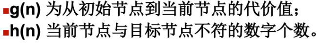
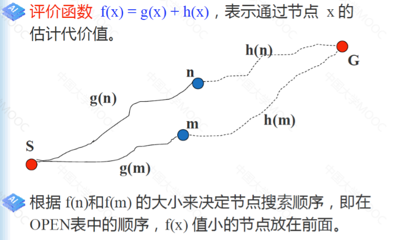
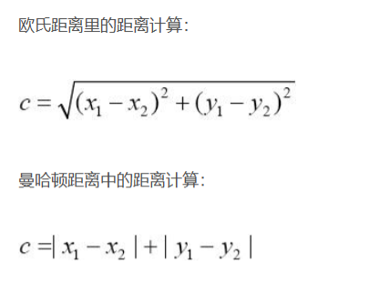
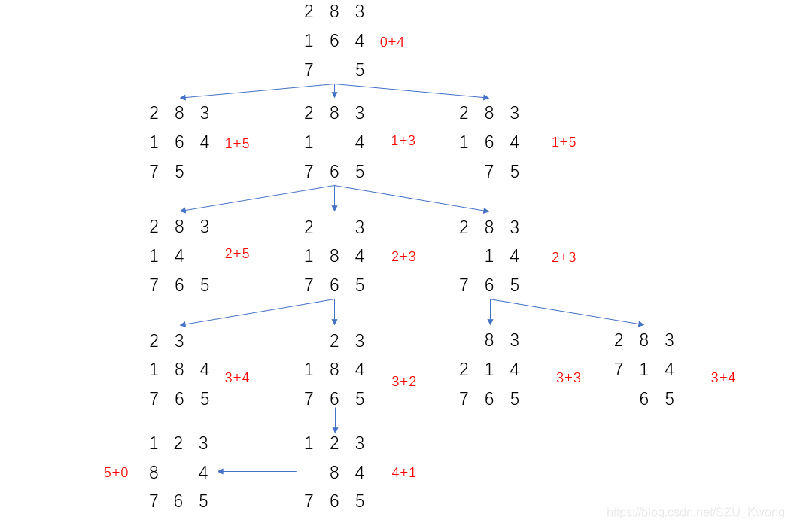

# A*算法

A*算法又叫做启发式搜索，也即在计算m个节点的图中，从起点s，到终点e的最短路径，途中经过节点n。

* A*算法给出了评价函数的定义： f(n) = g(n) + h(n)

* g(x)为从初始状态到当前状态的层数，g(s)=0. h(x)为启发式函数。

* f(n)为s到e的耗散值，每一次选出最小f(n)

求三种启发式函数分别为：

1）h(x)=0

2）h(x) = 错误位置和

3）h(x) = 错误位置曼哈顿距离和

过程图

