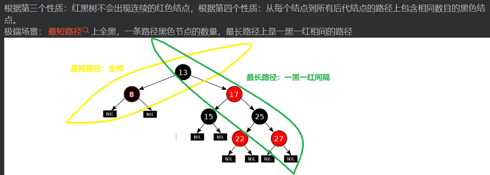
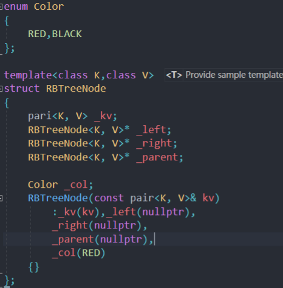

# 红黑树

红黑树是一种二叉搜索数，不同点在于每个结点可以存储颜色

颜色可以是红色或者黑色。红黑树确保最长低于最短的两倍

树的路径是从根走到空结点

### 红黑树的性质

* 每个结点不是红色就是黑色
* 根结点是黑色
* 如果一个结点是红色，则两个孩子结点是黑色

* 从任意一个结点开始，到任意叶子结点为止，路径上所有黑色结点数相同
* 由于空结点也是树的一部分，根据第一性质，规定为黑色

### 红黑树的定义

### 红黑树的插入

