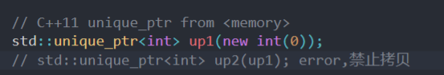
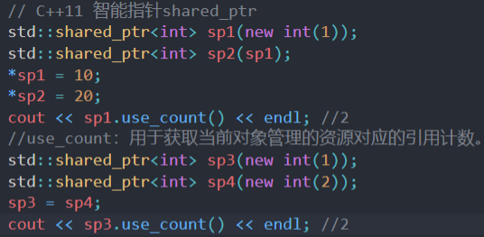

# 智能指针

## 1.例子

```cpp
// 智能指针
template<class T>
class SmartPtr
{
public:
	SmartPtr(T* ptr)
		:_ptr(ptr)
	{}
	~SmartPtr()
	{
		cout << "delete: " << _ptr << endl;
		delete _ptr;
	}
	T& operator*()
	{
		return *_ptr;
	}
	T* operator->()
	{
		return _ptr;
	}
	T& operator[](size_t pos)
	{
		return _ptr[pos];
	}
private:
	T* _ptr;
};
```

智能指针好处在于借托对象析构函数来释放资源。

浅拷贝 (shallow copy) 只是对指针的拷贝, 拷贝够两个指针指向同一个内存空间. [深拷贝](https://so.csdn.net/so/search?q=深拷贝&spm=1001.2101.3001.7020) (deep copy) 不但对指针进行拷贝, 而且对指针指向的内容进行拷贝. 经过深拷贝后的指针是指向两个不同地址的指针.

编译器默认拷贝是浅拷贝，只会对值进行复制，用的是相同地址，对于指针而言，如果浅拷贝就会出现两个指针指向同一区域

如果智能指针发生拷贝，对同一区域的析构就会发生两次----指针悬挂，造成程序崩溃。

智能指针解决该问题的方式不同，导致多种智能指针

## 2. CPP中的智能指针

### 2.1 auto_ptr

【c++98】

通过权限转让的方式解决拷贝问题

保证一个资源只能被一个对象管理


### 2.2 unique_ptr

直接禁止拷贝,终究有局限性



### 2.3 shared_ptr

其实问题在于解决浅拷贝多次析构

一般来想直接使用深拷贝，让每个指针对象new一片新的区域不就好了，但是这样显然会导致相同的数据复制了多份空间，不是明智之选。

这里则在shared_ptr这个类中，加入一个int *_pcount;

后续浅拷贝得到的智能指针，这个指针指向的值会加一

当智能指针不再使用或者析构时,pcount区域的值会减一，**只有所有的管理者都析构完，才会进行唯一一次delete**



之所以使用int*,显然不能让每一个对象都开辟一个int区域，而是多个ptr指向同一个int区域。

这时候可能会想到既然公用pcount区域的话，为什么不用static 类型。

如果使用static,在`shared_ptr<int>`和`shared_ptr<long>`同时出现,就会产生不同类型却共用同一个公有的static变量。


* 有关`shared_ptr`的线程安全问题

因为自增自减不是原子操作，需要加锁

* 有关`shared_ptr`循环引用的问题

  ```cpp
  void test_shared_ptr2()
  	{
  		std::shared_ptr<ListNode> n1 (new ListNode);
  		std::shared_ptr<ListNode> n2 (new ListNode);
  
  		n1->_next = n2;
  		n2->_prev = n1;
      }
  ```

  连接操作导致的循环，无法析构

  如果n1想要析构，就要释放指针的内容，但是指针指向n2,那么意味着要想析构n1，就要先释放_next；同理释放n2的过程中，n2要释放指针，但是指针_pre要先释放。

  这样相互等待对方释放，就会造成死循环。

  

  ### 2.4 weak_ptr

  用于解决`shared_ptr`循环问题

  weak和shared 一同管理

  实际weak不参与管理，不增加资源计数

  ```cpp
      struct ListNode
  	{
  		std::weak_ptr<ListNode> _prev;
  		std::weak_ptr<ListNode> _next;
  
  		~ListNode()
  		{
  			cout << "~ListNode()" << endl;
  		}
  	};
  
  	void test_shared_ptr2()
  	{
  		std::shared_ptr<ListNode> n1 (new ListNode);
  		std::shared_ptr<ListNode> n2 (new ListNode);
  
  		n1->_next = n2;
  		n2->_prev = n1;
  
  		cout << n1.use_count() << endl;
  		cout << n2.use_count() << endl;
  	}
  
  ```

  这时，当要析构n1时，要释放掉n1->_next,不再向n2寻求，而是n1的weak_ptr自带的指针(构造获得数据)

  注意这里的问题不在于 像前面一样两个指针指向同一区域，

  可以看到一开始初始化了两个区域，本质上n1,n2计数各自只有1(weak不参与),

  问题在于**连接后相互等待析构彼此**

  所以干脆将初始化的两个区域分别保存在weak里，然后析构

  而不是相互企图析构另一个指针的区域

  