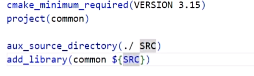
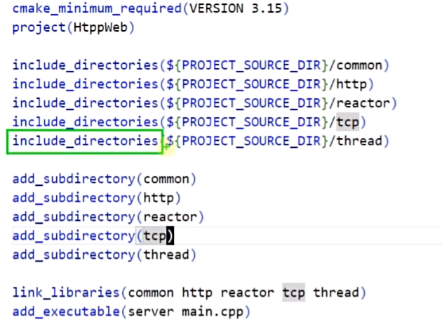
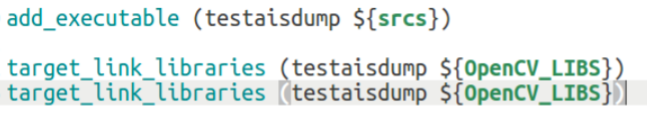

# Sylar服务器开发

## 配置报错及其他

### 项目目录结构

```txt
build #中间文件目录
aspect[name] #源代码文件
CMakeLists.txt
lib #库输出
bin #二进制
tests #测试源代码
```

### cmake

1. [4. CMake 中 set 的使用 - 下_哔哩哔哩_bilibili](https://www.bilibili.com/video/BV14s4y1g7Zj?p=4&vd_source=2b3a7e4dffb44c07076538fe075cb1cf)

#### Toolchain

编辑器将源文件变成可运行文件（如果使用集成环境，点击编译就可以生成可执行文件）

称之为toolchain（整个过程就是高级语言转换成二进制可执行文件）

1. 预处理器（预编译）将头文件展开，宏替换，注释去掉

   ​    `gcc - E test.c  -o test.i`

   -E使得预处理后停止

2. 编译器gcc/g++   

   ` gcc -S test.i -o test.s`   -S代表停止不进行后续。生成**汇编代码**

3. 汇编（器）将汇编代码转换成**机器码** 二进制也就是.o或obj 叫做**目标文件**

   `gcc -c test.s -o test.o`

4. 链接器（对`windows *.obj,linux *.o`)将目标文件和其他头文件库文件链接成可执行文件

   `gcc test1.o test2.o test3.o -o main`
   
   -g支持调试信息
   
   g++ -g test.cc -o test

最后生成可执行文件

常用命令

`gcc/g++ test.cxx -o test.o`

`gcc/g++ test.o -o main`

或者 `gcc/g++ test.cxx -o test` 直接生成

[一文教你快速上手GDB程序调试 - 知乎 (zhihu.com)](https://zhuanlan.zhihu.com/p/196763202)

#### makefile

编写`makefile`

make批处理命令使得makefile运行

cmake能根据不同平台生成对应makefile


#### cmake命令

1. [(116条消息) Cmake编写CmakeList.txt 语法备忘_HW140701的博客-CSDN博客](https://blog.csdn.net/HW140701/article/details/90203141?utm_medium=distribute.pc_relevant.none-task-blog-2~default~baidujs_baidulandingword~default-2-90203141-blog-105183076.235^v36^pc_relevant_default_base3&spm=1001.2101.3001.4242.2&utm_relevant_index=5)

* 如何make

`cd build`

`cmake ..//CMakeLists在上一层目录,生成makefile文件`

`make`

* `cmake --version //查看版本`

* 如何更换低版本`cmake`

1. [(116条消息) ubuntu改变cmake版本_mdjxy63的博客-CSDN博客](https://blog.csdn.net/mdjxy63/article/details/82686504)

2. [(116条消息) ubuntu安装cmake-CSDN博客](https://blog.csdn.net/yuanzhoulvpi/article/details/122938078)

```
sudo apt-get install build-essential
 
#http://www.cmake.org/files  这个网站里面有cmake的所有版本的列表，下载对应的cmake版本
wget http://www.cmake.org/files/v3.4/cmake-3.4.1.tar.gz
tar xf cmake-3.4.1.tar.gz
cd cmake-3.4.1

//检查是否有报错
./bootstrap

make

//如果cmake --version失效，cp bin/cmake /usr/bin/
```

* 卸载cmake

  `which cmake`查看是否有cmake

  `sudo apt-get remove cmake` 卸载已有cmake

#### 编写CMakeLists.txt

* `add_executable(test tests/test.cc)`

  多个源文件可以用空格或分号，执行`cmake ..`直接生成可执行文件

* `SET(EXECUTABLE_OUTPUT_PATH ${PROJECT_SOURCE_DIR}/bin)`

  将变量写到$的大括号里，指定可执行文件的输出路径

* set也可以用来设置c++标准，不论是lists里面还是cmake命令后面

* 生成静态库，可执行文件大，运行快；动态库可执行文件小，运行慢

  生成的静态库名字和文件名一致

  静态link_library放到executable前面

  动态target_link_library放到最后面，也可以链接静态库

* cmake_cxx_flags

  [(116条消息) CMake指令解析 set(CMAKE_CXX_FLAGS “$ENV{CXXFLAGS} -rdynamic -O3 -fPIC -ggdb -std=c++11 -Wall -Wno-deprec_For Nine的博客-CSDN博客](https://blog.csdn.net/m0_51551385/article/details/125083575)

**案例**

子节点CMakeLists,项目名是子节点目录名，搜索源文件，生成静态库



根节点CMakeLists，添加子目录，链接各个子节点，添加可执行文件



#### gdb调试教程

参考：[(123条消息) linux下gdb调试方法与技巧整理_花开蝶自来-liu的博客-CSDN博客](https://blog.csdn.net/niyaozuozuihao/article/details/91802994)

`gcc -g test.c -o test` g表示可调试

`gdb test`

`gdb -q test` 不打印gdb信息

进入gdb状态

`list` 查看源码 配合函数名，行号等使用

`run/r` 运行直到结束或者断点

`break/b [lineNum]` 设置断点

`info breakpoints` 查看断点

`delete/disable/enable/clear [lineNum]` 处理断点

`delete breakpoints`删除所有

`continue/next/step` = > ` c/n/s` 单步执行

`print [variable]`  查看变量值

`whatis [variable]` 查看变量类型


### boost库安装

1. [(117条消息) ubuntu 安装 Boost_乌恩大侠的博客-CSDN博客](https://blog.csdn.net/qq_36666115/article/details/131015894)

### yaml-cpp库使用

* parse error或者badfile

  校验yaml语法

  [YAML、YML在线编辑器(格式化校验)-BeJSON.com](https://www.bejson.com/validators/yaml_editor/)


### 报错

#### Cmake报错

* **Cannot specify link libraries for target " XXX XXX " which is not built by this project.**

  可能是顺序错误executable在前，也可能是空格是中文空格

  

### Cpp笔记

* 宏

1. 一个#号表示用**带引号的字符串**完全替代，两个#会检查前后逗号空格一并删除，并将第二个参数直接连接到第一个参数后例如XX(front,back)  front ## back  最后XX(name,1)结果为name1

   可变参数的宏__ VA_ARGS __ 参数中用...表示替换若干个参数，c99出现，只用于gcc ，由于可变参数为0个时，宏替换会多一个逗号，这时需要加上##来去掉逗号。

* typeid().name()返回类型名

* namespace

  ```cpp
  	/**
  	* 无命名的命名空间，和静态变量具有一样的声明周期，直至程序结束销毁
  	* 并且和一般命名空间一样，都只能通过当前源文件访问这个空间
  	* 好处是等同于声明静态变量
  	* ---------------PAY ATTENTION!!!----------------------
  	* 1.同一文件可以有两个无命名，不同文件的两个无命名成员名字可以一样，因为在不同作用空间；
  		但是相同文件不同无命名不能有重名成员！！！
  	* 2.无命名成员不能和全局变量同名，会产生二义性
  	* 3.可以嵌套（和普通一样）
  	* ---------------PAY ATTENTION!!!----------------------
  ```

* const & 用于返回值时控制指针权限

  const &用于**自定义类型** 临时复制或者构造减少时间
  
* 代码区：存储代码
  全局数据区：**static** 数据, 全局变量, const常量
  堆区：由程序员自己new出来的动态数据， 需要手动释放。若忘记释放，会造成内存泄漏，则程序结束时会由操作系统回收。
  栈区：函数内部变量，由IDE自动分配，结束时自动释放。

## 日志系统

### 日志01框架搭建

Logger日志器

`LogAppender`日志输出地

`LogFormatter`日志格式器

`LogEvent`日志事件

### 日志02 logger


## 配置系统

使用Yaml进行配置

### Yaml文件

1. [YAML 入门教程 | 菜鸟教程 (runoob.com)](https://www.runoob.com/w3cnote/yaml-intro.html#:~:text=YAML 是 "YAML Ain't a Markup Language"（YAML 不是一种标记语言）的递归缩写。,YAML 的语法和其他高级语言类似，并且可以简单表达清单、散列表，标量等数据形态。 它使用空白符号缩进和大量依赖外观的特色，特别适合用来表达或编辑数据结构、各种配置文件、倾印调试内容、文件大纲（例如：许多电子邮件标题格式和YAML非常接近）。 YAML 的配置文件后缀为.yml ，如： runoob.yml 。)


* dynamic_cast

  将指向类的指针转换成指向子类的指针

  智能指针用dynamic_pointer_cast

  1. [C++中的dynamic_cast和dynamic_pointer_cast - 星空之主 - 博客园 (cnblogs.com)](https://www.cnblogs.com/xingkongzhizhu/p/12963397.html)

### 配置变更事件

### 日志系统整合配置系统

## 线程模块

使用c++11的线程，互斥量使用pthread

协程在线程上跑

这里更多用协程

# 参考链接

1. c语言实现协程库

   [cloudwu/coroutine: A asymmetric coroutine library for C. (github.com)](https://github.com/cloudwu/coroutine/tree/master)
