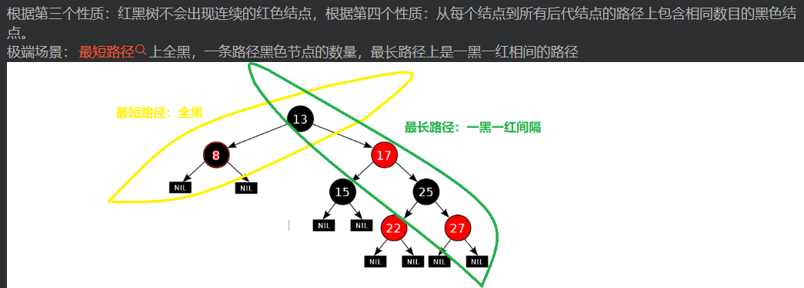
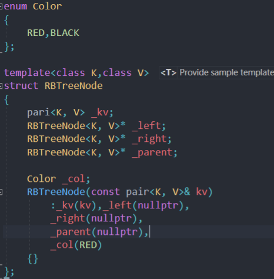
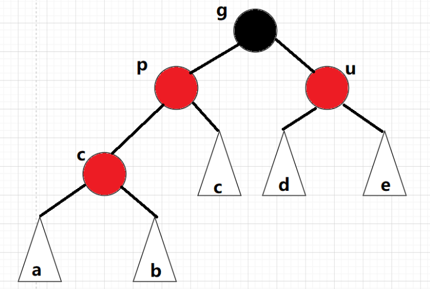
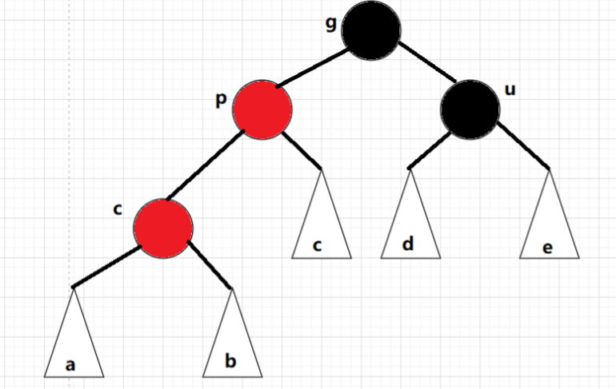
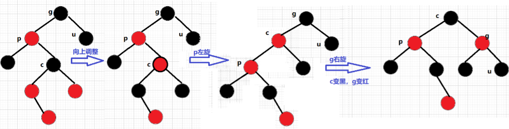

# 红黑树

红黑树是一种二叉搜索数，不同点在于每个结点可以存储颜色

颜色可以是红色或者黑色。红黑树确保最长低于最短的两倍

树的路径是从根走到空结点

### 红黑树的性质

* 每个结点不是红色就是黑色
* 根结点是黑色
* 如果一个结点是红色，则两个孩子结点是黑色

* 从任意一个结点开始，到任意叶子结点为止，路径上所有黑色结点数相同
* 由于空结点也是树的一部分，根据第一性质，规定为黑色

### 红黑树的定义

### 红黑树的插入

1. 上述将默认的结点定义成红色，当parent节点为黑色，插入后符合要求

2. 当parent节点为红色，祖父结点grandfather,就为黑色

   * uncle结点存在且为红色时

     
     
     为了插入新的红色结点时，考虑到不能有连续的红色，将parent结点更新成黑色，同时uncle结点更新成黑色(保证同一点出发黑色相同)
     
     然后grandfather结点需要更新成红色，因为grandfather如果是子树的话，意味着经过grandfather的路径上的黑色变多了一个，那么需要减少一个。
     
     如此反复，直到grandfather为根结点，最后为黑色
     
   * uncle结点存在，为黑色时；
   
   * uncle结点不存在，为黑色时只能让p变黑色，但是为了让两边黑色相等，这时让p来做根结点，g变红
   
     即当p,c为左，让g进行右旋变红；反之亦然
   
     
   
   * 以上讨论了同一侧，如果c,p一左一右呢
   
     p为g的左孩子，cur为p的右孩子，对p做左单旋转；
     p为g的右孩子，cur为p的左孩子，对p做右单旋转;
     旋转之后则转换成了情况2，在继续进行调整即可
   
     
   
     

补充旋转：

某个结点左旋，以右子树为轴，该结点变成右子的左子，该结点的右子为空，续上原先右子的左子作为右子

​	
