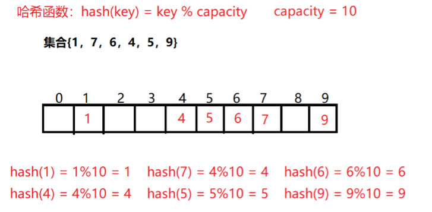
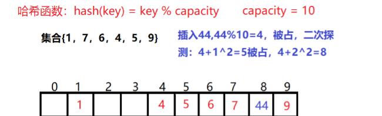

# 哈希

## Unordered 系列容器

参考：[(88条消息) 【C++】哈希——unordered系列容器|哈希冲突|闭散列|开散列_c++哈希冲突_平凡的人1的博客-CSDN博客](https://blog.csdn.net/weixin_60478154/article/details/129252674?spm=1001.2014.3001.5502)

**在C++98中，STL提供了底层为`红黑树结构`的一系列关联式容器**

**在C++11中，STL又提供了4个unordered系列的关联式容器，`这四个容器与红黑树结构的关联式容器使用方式基本类似`，只是其底层结构不同 :unordered系列的关联式容器之所以效率比较高，是因为其底层使用了`哈希结构`**

计算哈希函数直接得到地址

如果哈希函数设计的不够合理就会引发哈希冲突。

哈希函数设计原则：

> **哈希函数的定义域必须包括需要存储的全部关键码，而如果散列表允许有m个地址时，其值域必须在0到m-1之间**
> **哈希函数计算出来的地址能均匀分布在整个空间中**
> **哈希函数应该比较简单**

## 解决哈希冲突

解决哈希冲突两种常见的方法是：闭散列和开散列

### 1.闭散列——开放定址法

- **线性探测**：发生冲突寻找下一个空位置，问题是会导致发生冲突的数据堆积在一起

- **二次探测**

  