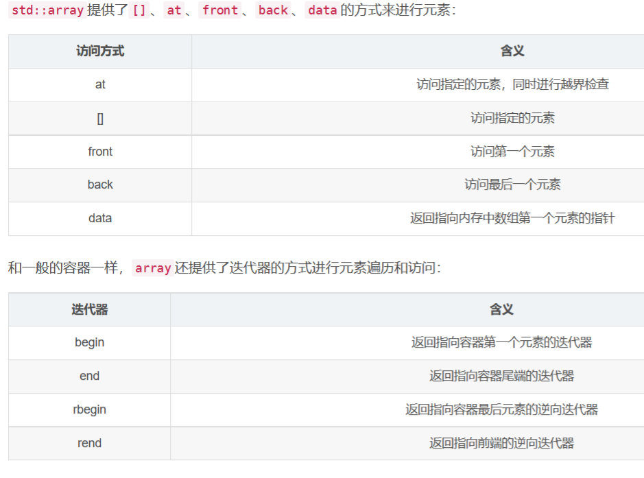

# Tiny Renderer From Scratch

## Preparations

### CMAKE

[Index of /files/PreviousRelease (cmake.org)](https://cmake.org/files/PreviousRelease/)

### MAKE FOR WINDOWS

https://gnuwin32.sourceforge.net/packages/make.htm

build 目录下cmake .. -DCMAKE_C_COMPILER=gcc -DCMAKE_CXX_COMPILER=g++ -G "Unix Makefiles"

配置c++

```cmake
cd build
cmake ..
make
```


## Project

### example1_point_lighting

main.cpp

constexpr c++11标准，可以使得const变量在编译阶段计算出值，而不是在运行阶段（也可能。。。）

| TRWindowsApp.cpp                                             |
| ------------------------------------------------------------ |
| SDL实际上封装了Direct3D，DirectSound这类的底层API,使用SDL播放一个视频代码流程大体如下: |
| [(70条消息) SDL2源代码分析1：初始化（SDL_Init()）_雷霄骅的博客-CSDN博客_sdl_init_video](https://blog.csdn.net/leixiaohua1020/article/details/40680907) |


* `std::cerr` 标准错误流，用于显示错误消息，默认被关联到标准输出流，但是不会被缓冲

  即直接发送消息到显示器，而不需要等到缓冲区或者新的换行符。一般不被重定向。

* c++11 shared_ptr（智能指针）

  `shared_ptr<T> ptr(new T); // T 可以是 int、char、类等各种类型`

  托管 p 的 shared_ptr 对象在消亡时会自动执行`delete p`

* using 使用

  

* 使用make_shared创建shared_ptr

	1. 如果选择使用 make_shared 的话, 内存分配的动作, 可以一次性完成，因为std::make_shared申请一个单独的内存块来同时存放指向的对象和控制块，这减少了内存分配的次数, 而内存分配是代价很高的操作

2. 同时，使用std::make_shared消除了一些控制块需要记录的信息，减少了程序的总内存占用。

* `std::array`是具有固定 大小的数组，简单来说，**`std::array`除了有内置数组支持随机访问、效率高、存储大小固定等特点外，还支持迭代器访问、获取容量、获得原始指针等高级功能。而且它还不会退化成指针给开发人员造成困惑**

  使用gcc编译需要指定c++11

  ```cpp
  std::array<int, 5> a0 = {0, 1, 2, 3, 4};         
  std::array<int, 5> a1 = a0;                      
  ```

  
