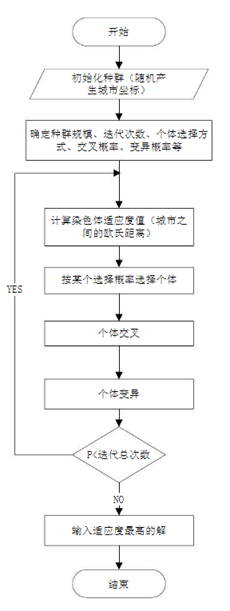
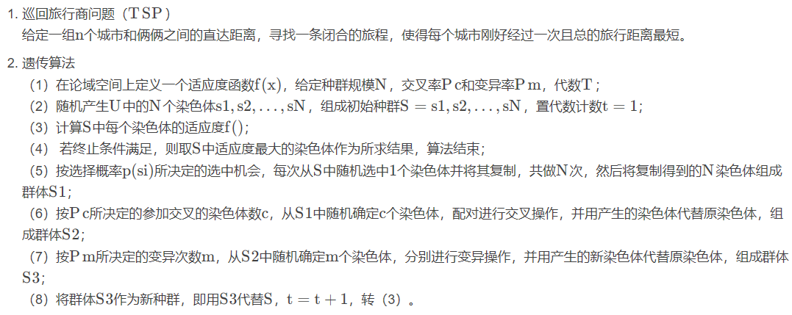

# 遗传算法求解TSP问题

参考：

1. [遗传算法入门详解 - 知乎 (zhihu.com)](https://zhuanlan.zhihu.com/p/100337680)
2. [(92条消息) 遗传算法求解TSP问题（C++实现）_遗传算法求解tsp问题c++_LeopoldZhang2000的博客-CSDN博客](https://blog.csdn.net/LeopoldZhang2000/article/details/104339931)
3. [轮盘赌算法 - 知乎 (zhihu.com)](https://zhuanlan.zhihu.com/p/140418005)

## What's Genetic Algorithm(GA)

遗传算法是一种**随机全局搜索优化方法**

它模拟了自然选择和遗传中发生的**复制**，**交叉**和变异现象。

从任意种群(Population)触发，随机选择、交叉(crossover)、变异(mutation)，产生更适应环境的个体。

一代一代繁衍最终收敛到最适应的个体，求解问题优质解。

## Terminology

1. Chromosome(染色体)，又称为基因个体，一定数量组成population
2. Bit String(位串) 个体表现形式，遗传学中的染色体
3. Gene(基因) 染色体中的颜色，位串中的单个元素
4. Feature(特征值) 参考二进制权重
5. Fitness(适应度) 引入适度值函数对每个染色体在群体中使用的概率
6. Genotype(基因型) 基因组特征表现，对应位串
7. Phenotype(表现型) 基因型在不同环境下的表现，对应位串解码后的参数

## Algorithm Procedure

SGA = (C,E,P0,M,Φ,Γ,ψ,T)

C：个体编码方案

E：个体适应度函数

P0：初始种群

M：种群大小

Φ ：选择算子

Γ：交叉算子

ψ：变异算子

T：终止条件

### 1.染色体编码

* 编码

从问题的解(solution)到基因型的映射称为编码，**即把一个问题的可行解从其解空间转换到遗传算法的搜索空间的转换方法**

常见的编码方法有**二进制编码**、**格雷码编码**、 **浮点数编码**、**各参数级联编码**、**多参数交叉编码**等。

* 解码

**遗传算法染色体向问题解的转换**

### **2.初始群体的生成**

设置最大进化代数 T ，群体大小M ，交叉概率 Pc ，变异概率 Pm，随机生成 M个个体作为初始化群体 P0 。

### **3.适应度值评估检测**

**适应度函数表明个体或解的优劣性**

### **4.遗传算子**

### 5.终止条件判断

**需要注意的是：**

遗传算法有4个运行参数需要预先设定，即

M ：种群大小

T：遗传算法的终止进化代数

Pc ：交叉概率，一般为0.4~0.99

Pm ：变异概率，一般取0.001~0.1

## Concrete

### 原理

原理图

### 轮盘赌选择算法

下图分别为选中概率和累积概率:

其中f(xi)表示适应度，适应度越大选中概率大。

选中概率是某个位置的概率

累积概率相当于转盘的"跨度",也即单个部分的概率

轮盘赌选择法的过程如下：

（1）计算每个个体的被选中概率p(xi)

（2）计算每个部分的累积概率q(xi)

（3）随机生成一个数组m，数组中的元素取值范围在0和1之间，并将其按从小到大的方式进行排序。若累积概率q(xi)大于数组中的元素m[i]，则个体x(i)被选中，若小于m[i]，则比较下一个个体x(i+1)直至选出一个个体为止。

（4）若需要转中N个个体，则将步骤（3）重复N次即可

注解：

Αα 阿尔法 alfa
Ββ 贝塔 bita
Γγ 伽马 gama
Δδ 德耳塔 dêlta
Εε 艾普西龙 êpsilon
Ζζ 截塔 zita
Ηη 艾塔 yita
Θθ 西塔 sita
Ιι 约塔 yota
Κκ 卡帕 kapa
∧λ 兰布达 lamda
Μμ 米尤 miu
Νν 纽 niu
Ξξ 克西 ksai
Οο 奥密克戎 oumikelong
∏π 派 pai
Ρρ 若 rou
∑σ 西格马 sigma
Ττ 套 tao
Φφ 斐 fai
Χχ 喜 hai
Υυ 宇普西龙 yupsilon
Ψψ 普西 psai
Ωω 欧米伽 omiga

